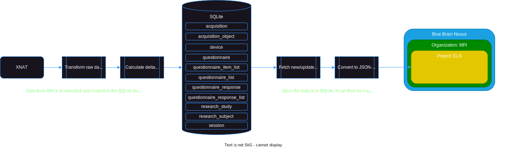

# nexus_etl
This folder contains scripts for loading data from [XNAT](https://www.xnat.org/) to [Blue Brain Nexus](https://bluebrainnexus.io/).

We demonstrate here how to load the data on to a local instance of NEXUS, but this can easily be extended to a cloud instance.

## Data Flow


## Installation
This section outlines the steps needed to run the ETL flow in your own environment. A makefile is provided to run many of the steps in a flexible manner.

1. Setup python environment

    ```bash
    git clone https://github.com/Cogitate-consortium/xnat-nexus-etl
    cd nexus_etl
    python3 -m venv venv
    source venv/bin/activate
    cd nexus_etl
    pip install -r requirements.txt
    ```

2. SQLite Database Setup
    After activating your virtual enironment, go to the nexus_etl/database folder and run the initialize_database.py script. This can also be done by calling simply `make database`.

3. Install and setup nexus locally / cloud. Follow the [instructions here](https://bluebrainnexus.io/docs/getting-started/running-nexus/index.html). We recommend installing it with docker. Start the docker container with `cd $(NEXUS_DOCKER_DIR); docker compose --project-name nexus --project-directory $(NEXUS_DOCKER_DIR) --file $(NEXUS_DOCKER_CONFIG) up --detach` or simply `make docker`.

4. Configure nexus and xnat authentication by following the additional instructions in the below directories,
   - common
   - sensitive

5. Now everything should be setup and we can run the ETL scripts in two phases,
   - `make src_to_dw` loads data from XNAT to a local database
   - `make dw_to_nexus` loads data from the local database to NEXUS
   - If there are errors, please check if the connections to XNAT and NEXUS are configured correctly and that the instructions in step 4 have been followed.

6. Given the data has been loaded, various queries may be run using the Jupyter notebooks provided under sample_query_notebooks.

## Repository Contributors
- [Adeel Ansari](https://github.com/adeel-ansari)
- [Mohana Ramaratnam](https://github.com/mohanakannan9)
- [Praveen Sripad](https://github.com/pravsripad)

## Acknowledgements
This project was made possible through the support of a grant from Templeton World Charity Foundation, Inc. The tool has been developed as a part of the [ARC-COGITATE](https://www.arc-cogitate.com/) project.
